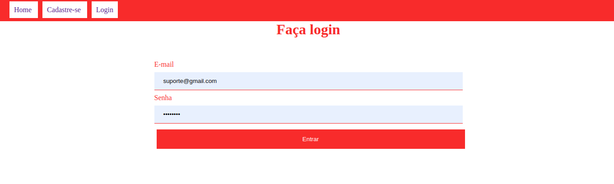
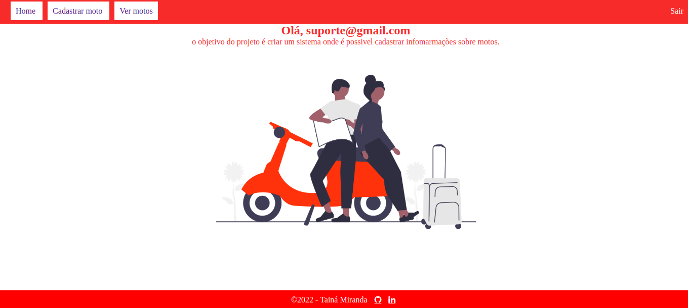
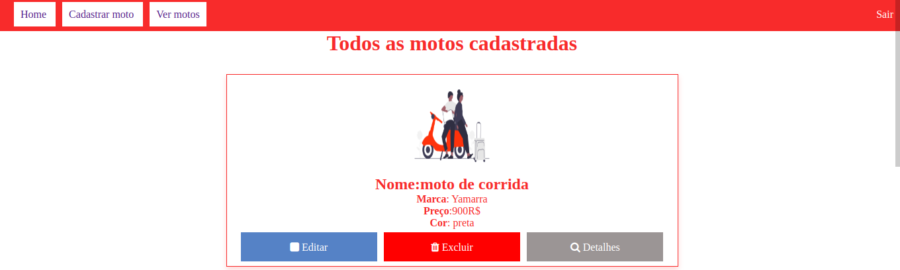

## Para clonar o projeto - Basta dar um git clone com a url em questão, tenha o mysql e o php na versão 8.1

# Descrição
 ## histoŕia - se trata de um site de exposição de motos 

 ## funcionalidades - criar, ler, editar, apagar informações sobre as motos

 ## funcionalidades extras -  cadastro, login de usúarios, ver mais

 ## Link do projeto online - <a href="https://crud-user-php.000webhostapp.com/moto-evolue">moto evolue</a>
## Link da documentação/explicação com mais detalhes projeto - <a href="https://docs.google.com/document/d/16O3yTOICzRBWRrPd_YkVloSo7j1QKSvPSSuCHSiFC-I/edit?usp=sharing">documento</a> 
## Tecnologias  utilizadas- PHP + MYSQL

### PHP - Linguagem de programação com emorme comunidade
### PHPMYADMIN - Para facilitar o trabalho com banco de dado
### MYSQL - banco de dados mais utilizados e com uma enorme comunidade para tirar dúvidas

